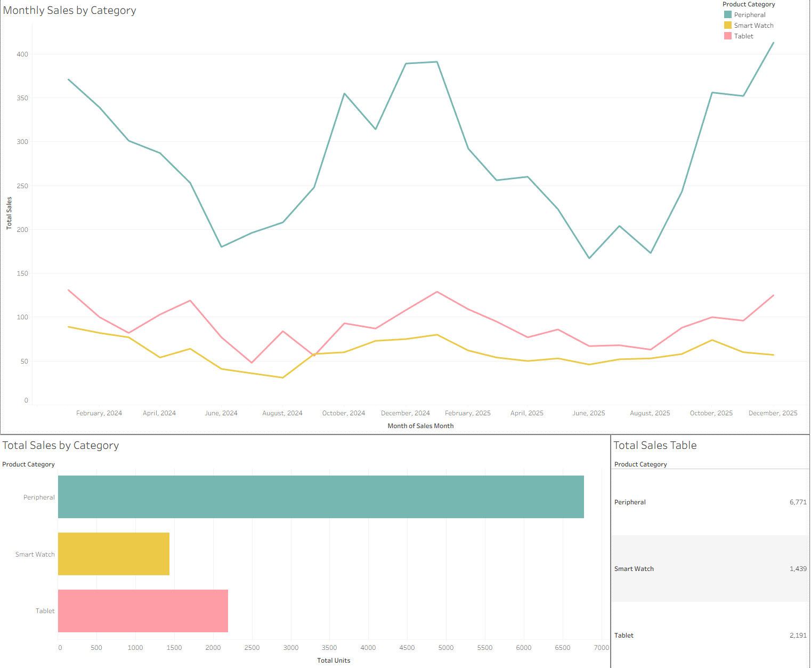

# Seasonal Demand Analysis for Inventory Planning

<b>Summary</b>

Sales data for a hypothetical consumer electronics company was analyzed to inform inventory planning. The analysis found a seasonal demand structure, with products in the peripherals category making up most of the absolute peak-to-trough decline. 

Recommendations: Develop inventory targets based on seasonal patterns and forecast peak peripherals demand to help minimize stockout and carrying costs. 

Data: AI-generated synthetic sales data covering 2024–2025, created for this case study to simulate a consumer electronics sales environment.

Tools: Excel, PostgreSQL (pgAdmin), Python (pandas, NumPy, scikit-learn, matplotlib), Tableau.

<h2><b>Executive Narrative</b></h2>

<b>Business Question</b>: How can a (hypothetical) consumer electronics company use patterns in sales data to help make inventory planning decisions? 

<b>Context and Assumptions</b>: Management is concerned that inventory planning is being done haphazardly and wants insights into sales data to make informed decisions. The study is focused solely on sales data on existing products and customers. It is not concerned with strategies to increase sales. 

<b>Approach</b>: The study analyzed two years of sales from 2024 to 2025, aggregated to a monthly basis. It assessed patterns in sales over time, and proportion of sales among the three product categories: peripherals, smart watches, and tablets. 

<b>Findings</b>: Sales data demonstrated a seasonal pattern, with peaks around January, and troughs around July. Sales decline for roughly the first half of the year and turn upward for roughly the second half. 

All three product categories showed similar seasonal swings, with peak-to-trough decline of ~53%.  Peripherals account for most of the aggregate decline in units at 63.23%, with smart watches at 13.79% and tablets at 22.98%. 

<b>Surprises / Insights</b>: Sales did not follow a straightforward linear trend. A trigonometric model provided a substantially better fit and showed that sales follow a recurring seasonal pattern (note: see technical notebook for details on the modeling process).

<b>Recommendations</b>:

Seasonal inventory planning

> <b>Data insight</b>: Sales follow a seasonal structure with cycles of peaks and troughs.  
> 
> <b>Takeaway</b>: Inventory planning should account for seasonal variation in demand, rather than a single year-round target.
>
> <b>Action step</b>: Develop seasonal inventory targets guided by demand patterns in the data.

Forecast peak peripherals demand

> <b>Data insight</b>: Peripherals make up the largest part of aggregate peak-to-trough decline at ~63%.
>
> <b>Takeaway</b>: Peripherals are likely to have a stronger impact on seasonal inventory requirements.
>
> <b>Action step</b>: Forecast peak seasonal demand for peripherals, with the aim of minimizing stockout and carrying costs. 

<b>Limitations</b>: This study only examined sales by product category. Additional research is required to apply the findings to specific products. 

Findings are based on historical sales data. Changes in factors that affect sales patterns, such as customer preferences and market share, will require the findings to be reassessed with more current data.

This case study uses synthetic sales data with the aim of demonstrating analytical approach. It is not intended to make recommendations for live business practice. 

<b><h2>Repository Contents</b></h2>

- Presentation - visual overview of the case study.
- Technical notebook - analytical workflow.
- Data - synthetic sales dataset used for the analysis.
- Assets - visualizations used in the README.
